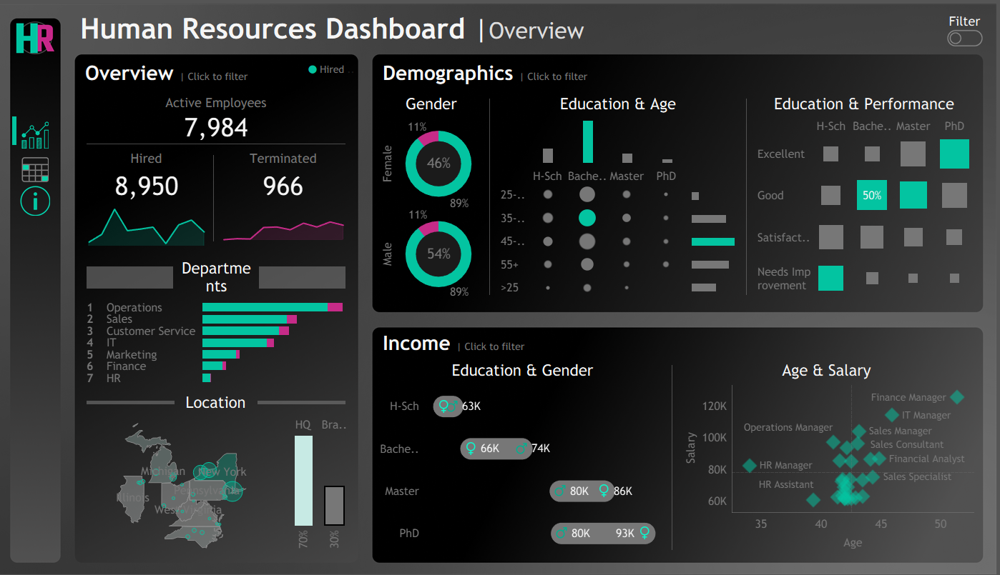
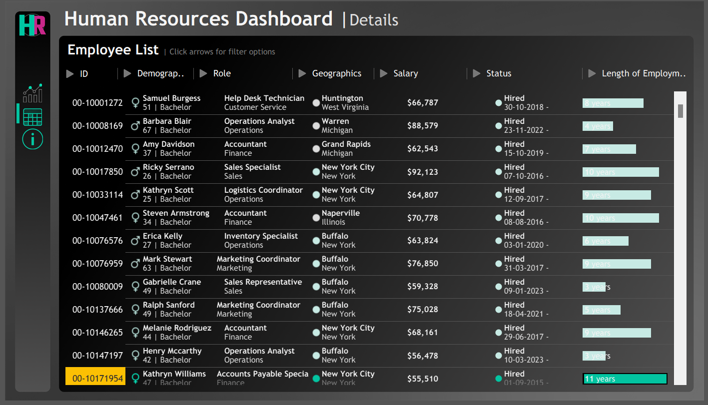
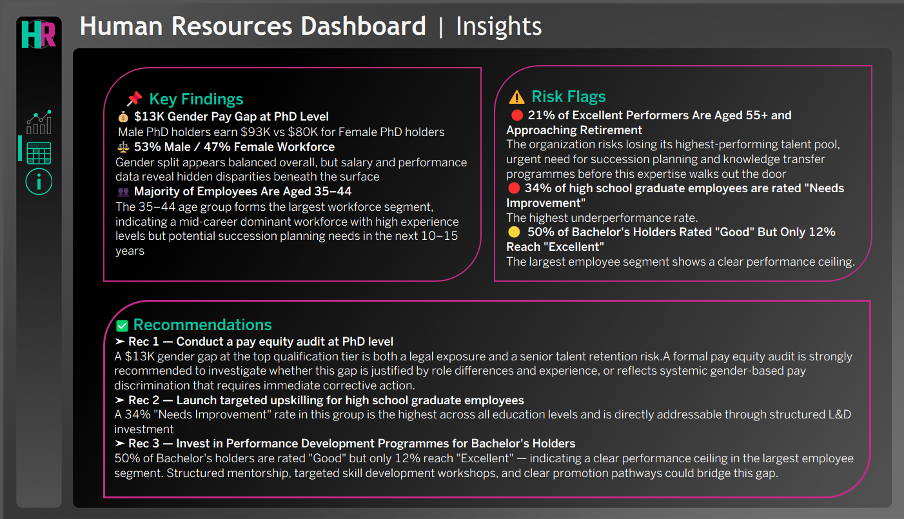

# Human Resources Dashboard | Tableau Portfolio Project

A fully interactive HR analytics dashboard built in Tableau, designed to give HR leaders and executives a clear view of workforce composition, compensation equity, performance trends, and actionable business insights — all from a single workbook.

---

## Dashboard Preview

### Overview Page

*High-level workforce snapshot: headcount, hiring trends, department breakdown, geographic distribution, demographic breakdown, and salary analysis.*

### Details Page

*Filterable employee-level table with drill-down capability across ID, demographics, role, location, salary, employment status, and tenure.*

### Insights Page

*Auto-generated narrative layer: key findings, risk flags, and strategic recommendations derived directly from the data.*

---

## Project Highlights

### What This Dashboard Does
| Section | Description |
|---|---|
| **Overview** | Live KPIs for active employees, hired vs. terminated; department and location breakdowns; demographic and salary distribution charts |
| **Details** | Searchable, filterable employee list with sortable columns — acts as a lightweight HR information system |
| **Insights** | Structured analytical narrative with Key Findings, Risk Flags, and Recommendations — translating data into decisions |

---

## Key Analytical Findings

### Pay Equity
- **$13K gender pay gap at PhD level** — male PhD holders earn $93K vs. $80K for female PhD holders
- Salary disparity widens at higher education levels, despite an overall near-balanced 54/46 gender split

### Workforce Demographics
- **Largest segment: 35–44 age group** — mid-career dominant workforce with high experience but emerging succession risk
- **21% of top performers are aged 55+** — urgent knowledge transfer risk requiring succession planning

### Performance Patterns
- **34% of high school graduates are rated "Needs Improvement"** — the highest underperformance rate across all education levels
- **50% of Bachelor's holders are rated "Good" but only 12% reach "Excellent"** — a clear performance ceiling in the largest employee group

---

## Strategic Recommendations Generated

1. **Conduct a pay equity audit at PhD level** — the $13K gap is both a legal exposure and a senior talent retention risk
2. **Launch targeted upskilling for high school graduate employees** — 34% "Needs Improvement" is directly addressable through structured L&D investment
3. **Invest in Performance Development Programmes for Bachelor's holders** — structured mentorship and clear promotion pathways to break the performance ceiling

---

## Skills Demonstrated

### Data Visualisation & Tableau
- Multi-page Tableau workbook with consistent dark-theme branding and custom color palette
- Interactive filters applied cross-sheet using Tableau's action filter framework
- Mix of chart types: donut charts, bubble/dot plots, scatter plots, bar charts, geographic maps, sparklines, and custom KPI cards
- Custom tooltips and formatted number displays ($, %, years)

### Dashboard Design & UX
- Custom sidebar navigation with icon-based page switching
- Cohesive dark UI with teal/magenta accent colors for visual hierarchy
- Responsive layout balanced between dense data and readability
- Narrative "Insights" page that bridges raw data and executive communication

### HR Analytics & Business Intelligence
- Workforce segmentation by age, gender, education level, department, and location
- Compensation analysis broken down by gender and education (pay equity audit lens)
- Performance rating distribution analysis across demographic segments
- Tenure and employment lifecycle tracking
- Risk identification framing (succession risk, underperformance risk, pay equity risk)

### Analytical Thinking
- Derived business-level findings from cross-dimensional data (e.g., education × gender × salary)
- Translated statistical observations into prioritised, actionable recommendations
- Applied a risk-severity framework to flag issues by urgency (critical vs. moderate)

---

## How to Open

1. Download and install [Tableau Public](https://public.tableau.com/app/discover) (free) or Tableau Desktop
2. Clone or download this repository
3. Open `HR Dashboard my version.twbx` in Tableau
4. Use the sidebar icons to navigate between Overview, Details, and Insights pages
5. Click chart elements or use the Filter toggle to interact with the data

---

## Dataset

The dashboard is built on a synthetic HR dataset containing **8,950 employee records** across:
- Demographics: age, gender, education level
- Employment: department, job title, hire date, termination date, status
- Compensation: annual salary
- Location: city, state, HQ vs. branch office
- Performance: performance rating (Excellent / Good / Satisfactory / Needs Improvement)

---

## About This Project

This dashboard was built as a portfolio project to demonstrate end-to-end business intelligence skills — from raw data to executive-ready insights. The design prioritises clarity for non-technical stakeholders while retaining the depth needed for HR analysts to drill into specifics.

---

*Built with Tableau | HR Analytics Portfolio Project*
